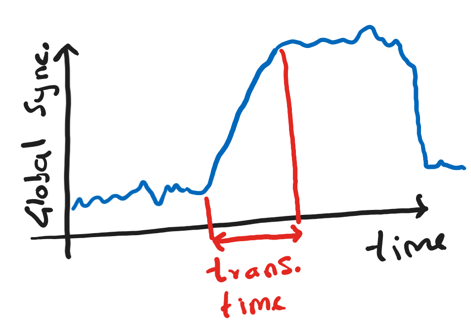
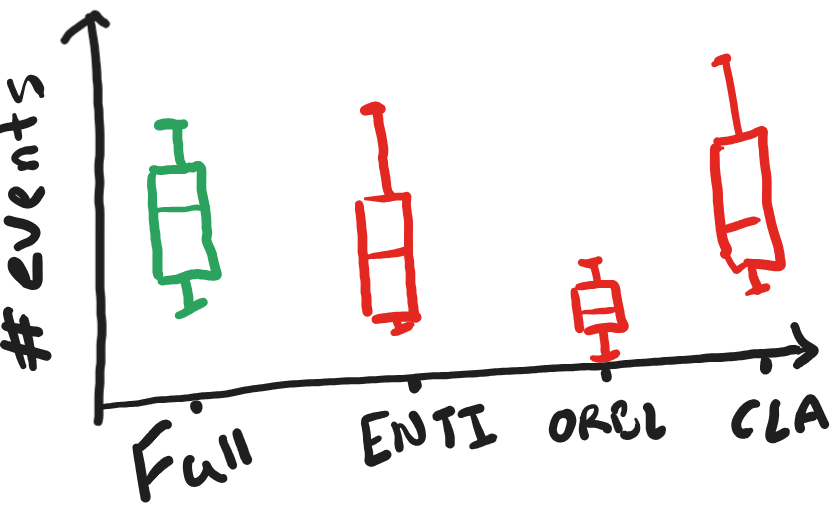
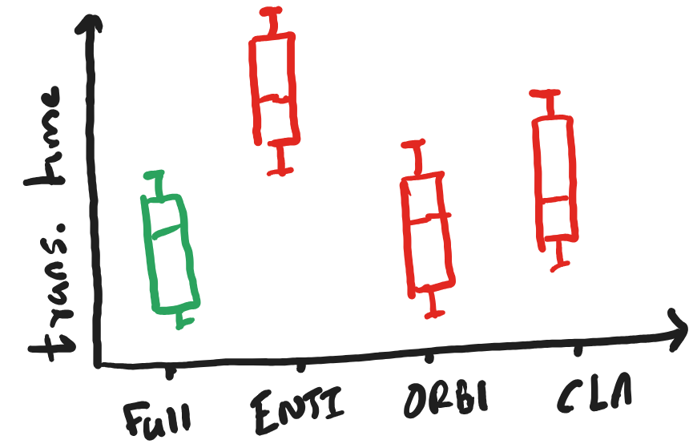

# Assignment for PhD position in CNDL

Please read the instructions below carefully to complete this assignment. The assignment is meant to test your reading, analytical, coding and overall research aptitude, and selection for the PhD position will be primarily based on your performance in this assignment.

Go through the steps below one at a time systematically.

- [ ] Create a new repository using this template.

You will find a manuscript titled `Ranjan and Gandhi - 2023 - ...`. The assignment is based on this manuscript.

You will also find a file named `solutions.md`. As you go through the assignment, you should add your results to this file.

## A model of epilepsy

- [ ] Please read the manuscript
- [ ] Based on this, what are the three major results that are presented in the study? Write them down in 1-2 lines in the `solutions.md` file in the area denoted for it.
- [ ] We find some key nodes in the mouse brain that may be important for the propagation of synchronization. Please name a few of these key nodes.

Answer the above before proceeding, otherwise you will not understand the next section.

## Using the model

The code for simulating the model presented in the paper can be found [here](https://github.com/csndl-iitd/tES_mesoscale_connectivity_model/). A simplified version of the code is also included in the `tES` folder in this repository.  
For the rest of the assignment, you will use this code as a starting point and run some new simulations.

The model itself is defined in `tES/Model/tES/tES_Adaptive.py`. This model was used to simulate and generate the results presented in the manuscript. You can check the code in `tES/Mouse brain network/MBN_Res_Constraint.ipynb` to understand how to use the model.

## New questions to answer based on the model

As you would have read, we find some nodes in the mouse brain that may play an important role in the transmission of synchronization. We want to understand if they are actually important for propagating synchronization.

To understand their role in synchronization, we will remove these nodes from the network and simulate the model again. We will then compare the properties of synchronization with and without the specific node to understand if it is actually important.

There are two properties that we will examine:
1. Frequency of tES, i.e. in a fixed amount of time, how many times do you get the tES event?
2. Speed of synchronization propagation (i.e. how quickly does the transition from unsynchronized to synchronized state happen? See transition time in the diagram below.)

## Answering the questions
 Please follow the following steps to answer the above two questions.

 ### Basic simulations

 - [ ] Simulate the model as it is without any changes. You should be able to do this using `tES/Mouse brain network/MBN_Res_Constraint.ipynb`.
 - [ ] In the simulation, how many times do you see a transition from the unsynchronized to synchronized state? Write a function to count this.
 - [ ] What is the transition time (figure above) of each transition? Write a function to compute this. You will have to come up with your own definition of the transition time based on the figure above.
 - [ ] Make a box plot of the transition time to show the average and distribution around the average transition time.
 - [ ] Repeat the simulation with a few different sets of initial conditions.
 - [ ] Make a box plot showing both number of transitions and transition time across all simulations.

### Advanced simulations

If you were able to do all of the above, proceed to the next steps:
- [ ] Choose some specific node that you want to remove.
- [ ] Simulate the model with a modified version of the adjacency matrix (`A` in `MBN_Res_Constrn.py` file) in which the chosen node is deleted. You can simply set the corresponding row and column connectivity to 0. Simulate a few times with different initial conditions.
- [ ] Repeat by removing a few other key nodes, _one at a time_.
- [ ] Make box plots for number of transitions and transition time including the full network as well as all networks that you generated after removing one node. The result should look something like this:

 

## Interpreting your results
All of you should attempt this based on whatever you have simulated.

- [ ] What do you observe? What does it mean?
- [ ] Based on the paper, what other factors can you think of that may affect the transition time and number of events? How will you check the effect of these factors?

## Submitting

After updating the `solutions.md` file with all your answers, simply commit and push back to your Github repository.

Email me with a link to your repository (make it public so that I can open it).

You can email me if you have any questions!
