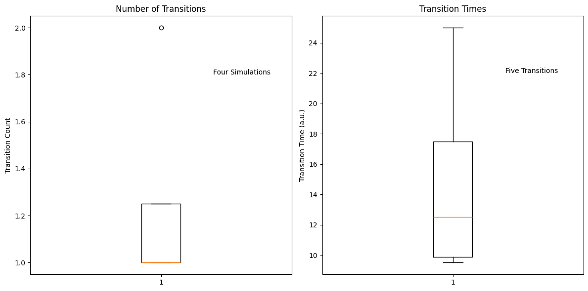

# Nitin Choudhury

## Three major results from the Ranjan et al study

1. The study demonstrates that the Kuramoto network model, incorporating resource constraint and adaptive coupling, can effectively replicate seizure-like synchronization activity across various network topologies, including a realistic mouse brain network. This indicates the model's ability to capture essential aspects of epileptic seizure dynamics.

2. During the sudden transition to the synchronized state, a wave-like propagation of synchronization across subnetworks within the MBN had been observed, beginning with cortico-thalamic subnetworks, followed by subcortical and deeper subnetworks.

3. The model shows that networks can switch abruptly between normal and hyper-synchronized states, a phenomenon known as transient explosive synchronization (tES). This occurs in both small world networks and the mouse brain network when certain conditions like adaptive coupling and resource constraint are met.

## Key nodes involved in the propagatin of synchronization

1. Cortex (19 nodes)
2. Hippocampus (6 nodes)
3. Striatum (9 nodes)
4. Thalamus (10 nodes)
5. Midbrain (3 nodes)
6. Perirhinal (PERI)
7. Entorhinal (ENTl)
8. Orbital (ORBI)
9. Reticular Nucleus (RE)
10. Basolateral Amygdala (BLA)
11. Piriform (PIR)
12. Agranular insular area (Ai)

## Basic model simulation (single iteration)

### How many transitions do you see in a single simulation run?

3

1

### How do you define the transition time?

Transition time refers to the duration when the brain network quickly changes from being unsynchronized to highly synchronized state. It is the period of rapid shift in synchronization levels across the network.

### What is the average transition time you observe? Include units!
11.35 a.u. 

### Include a box plot of the transition times for a single experiment below.

## Basic model simulation (different initial conditions)

### Include two box plots below, one for number of transitions and another for transition time

## Advanced simulations

### Box plot for number of events
Include the plot here.

### Box plot for transition time
Include the plot here.

## Interpreting results

Provide your answer here.